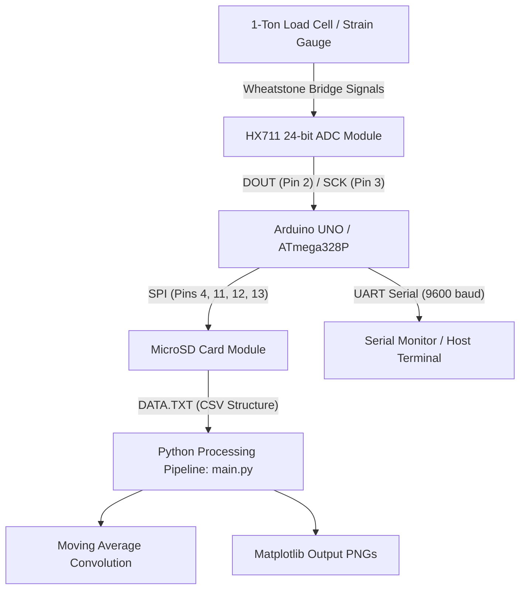

# Arduino Load Cell HX711 Logger

Data acquisition, logging, and signal processing system for strain gauge load cells using the HX711 24-bit analog-to-digital converter, Arduino UNO, SPI SD card storage, and Python offline analysis with moving average filtering.

---

## Technical Specifications

| Parameter | Specification / Value |
| :--- | :--- |
| **Microcontroller** | ATmega328P (Arduino UNO) |
| **ADC / Frontend** | HX711 24-Bit ADC for weigh scales and strain gauges |
| **Sensor Type** | 1-ton resistive strain gauge load cell |
| **Sampling Rate** | 10 Hz / 80 Hz (configured via HX711 RATE pin) |
| **Storage Interface** | SPI MicroSD Card Module (FAT16/FAT32) |
| **Communication** | UART Serial (9600 baud, 8N1) |
| **Moment Arm Length ($r$)** | 0.237 m |
| **Local Gravity Constant ($g$)** | 9.785 m/s² |
| **Offline Processing** | Discrete moving-average convolution filter (NumPy) |

---

## System Architecture



---

## Hardware Pinout and Wiring

### 1. HX711 Module to Arduino UNO

| HX711 Pin | Arduino UNO Pin | Function |
| :--- | :--- | :--- |
| `VCC` | `5V` | System Power Supply |
| `GND` | `GND` | Ground Reference |
| `DT` / `DOUT` | `Digital Pin 2` | Serial Data Output |
| `SCK` / `CLK` | `Digital Pin 3` | Serial Clock Input |

### 2. Strain Gauge Load Cell Wiring

#### Black Cable Model
* **Excitation Positive (`E+`)**: Red wire
* **Excitation Negative (`E-`)**: Black wire
* **Signal Negative (`A-`)**: White wire
* **Signal Positive (`A+`)**: Green wire
* **Shield**: Metallic mesh

#### Gray Cable Model
* **Excitation Positive (`E+`)**: Red wire
* **Excitation Negative (`E-`)**: Yellow wire
* **Signal Negative (`A-`)**: White wire
* **Signal Positive (`A+`)**: Green wire
* **Shield**: Black wire

### 3. SD Card Module (SPI Interface)

| SD Module Pin | Arduino UNO Pin | Function |
| :--- | :--- | :--- |
| `CS` | `Digital Pin 4` | Chip Select |
| `MOSI` | `Digital Pin 11` | Master Out Slave In |
| `MISO` | `Digital Pin 12` | Master In Slave Out |
| `SCK` | `Digital Pin 13` | Serial Clock |
| `VCC` | `5V` | Supply Voltage |
| `GND` | `GND` | Ground |

---

## Mathematical Formulation

### 1. Sensor Calibration Factor

The calibration factor maps raw ADC counts to physical units (kilograms):

$$\text{calibration\_factor} = \frac{\bar{x}_{\text{raw}}}{m_{\text{known}}}$$

Where:
* $\bar{x}_{\text{raw}}$ is the arithmetic mean of raw values from the HX711 reading.
* $m_{\text{known}}$ is the calibrated mass placed on the load cell.
* Default calibration factor calibrated for black cable unit: `-4700`.

### 2. Torque Calculation

The applied torque ($\tau$) is computed dynamically from the measured mass ($m$) using the lever arm length ($r = 0.237\text{ m}$) and local gravitational acceleration ($g = 9.785\text{ m/s}^2$):

$$\tau = F \cdot r = (m \cdot g) \cdot r = m \cdot 9.785 \cdot 0.237 \quad [\text{N}\cdot\text{m}]$$

### 3. Moving Average Convolution Filtering

To suppress high-frequency mechanical vibration and measurement noise, the signal $x[n]$ is convolved with a rectangular window $w[k]$ of length $N$:

$$y[n] = (x * w)[n] = \frac{1}{N} \sum_{k=0}^{N-1} x[n-k]$$

Where $N \in \{2, 4, 6, 8, 10, 12, 14, 16, 18, 20\}$.

---

## Firmware Descriptions

### 1. `loadcell.ino`
* Direct data acquisition via the `HX711.h` driver.
* Calculates mass ($m$) in kg and torque ($\tau$) in $\text{N}\cdot\text{m}$.
* Sends formatted readings via serial output at 1-second intervals.
* Supports runtime taring upon receiving character `'t'` or `'T'` via UART.

### 2. `loadcell_with_SD.ino`
* Integrates HX711 acquisition with real-time SD card file logging.
* Initializes SPI bus and opens `data.txt` in append mode (`FILE_WRITE`).
* Writes timestamped entries: `elapsedSeconds, Mass_kg, Torque_NM`.
* Retains runtime UART tare functionality.

### 3. `sampleSD2.ino`
* Diagnostic routine verifying SPI communication, file creation, writing, and closing on the MicroSD card module.

---

## Data Structure (`DATA.TXT`)

Logged data is formatted as comma-separated values (CSV):

```csv
Time (s), Mass (kg), Torque (NM)
1.954, 0.020, 0.027
2.205, 0.010, 0.027
2.498, 0.006, 0.019
2.792, -0.000, 0.002
3.085, 0.001, 0.010
```

---

## Signal Processing Pipeline (`main.py`)

The offline processing script performs the following operations:
1. Ingests raw data from `data.txt` using `numpy.loadtxt`.
2. Automatically detects and strips header strings when present.
3. Computes discrete 1D convolutions using `np.convolve(..., mode='valid')` across sliding window sizes from 2 to 20 with step 2.
4. Generates and saves the following plots to `cache/`:
   * Individual window plots: `grafico_massa_{window_size}.png`
   * Combined overlay plot: `concat.png`
   * Subplot grid comparison: `side_by_side.png`

---

## Sample Data Visualizations

### Sensor Acquisition Sample


### Filter Comparisons


---

## Installation and Execution

### Microcontroller Setup
1. Install Arduino IDE.
2. Install the `HX711` library (`https://github.com/bogde/HX711`) and standard `SD` / `SPI` libraries.
3. Select board `Arduino Uno` and the corresponding serial port.
4. Flash `loadcell_with_SD.ino` to the board.

### Python Environment Setup
1. Install dependencies:
   ```bash
   pip install numpy matplotlib
   ```
2. Create the output directory:
   ```bash
   mkdir -p cache
   ```
3. Run the analysis script:
   ```bash
   python main.py
   ```
